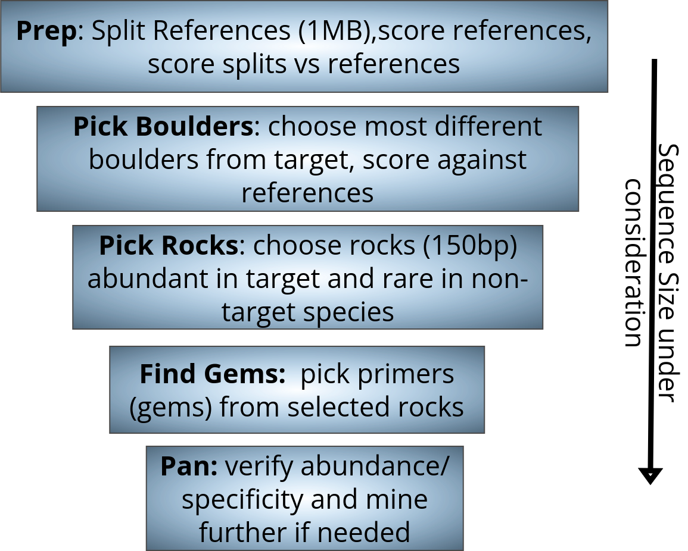

# ematille
Mining for Tick Blood Meal Hosts

# Methods

## Overview

{#fig:1 width="1\\linewidth"}

## Input

Ematille is designed as a turnkey solution with minimal configuration
and setup. Input to Ematille consists of a text file describing the
reference species and locations of the fasta files containing their
genomes. Instead of mining the entire genome, you can also provide the
regions of the reference genome that repeatmasker identified as
translatable elements extracted from the reference genome as the
reference.

flist.txt

  --- ---------- ------------------------------------------
    1 coyote     GCA_034620425.1_Cla-1_genomic.fna
    2 snake      GCA_023053685.1_rDiaPun1.0.p_genomic.fna
    3 deertick   GCF_000208615.1.fa
    4 mouse      mm39.fa
    5 squirrel   speTri2.fa
  --- ---------- ------------------------------------------

files downloaded from:

* https://ftp.ncbi.nlm.nih.gov/genomes/all/GCA/034/620/425/GCA_034620425.1_Cla-1/GCA_034620425.1_Cla-1_genomic.fna.gz
* https://hgdownload.soe.ucsc.edu/goldenPath/mm39/bigZips/mm39.fa.gz
* https://ftp.ncbi.nlm.nih.gov/genomes/all/GCA/023/053/685/GCA_023053685.1_rDiaPun1.0.p/GCA_023053685.1_rDiaPun1.0.p_genomic.fna.gz
* https://ftp.ncbi.nlm.nih.gov/genomes/all/GCF/000/236/235/GCF_000236235.1_SpeTri2.0/GCF_000236235.1_SpeTri2.0_genomic.fna.gz
* https://hgdownload.soe.ucsc.edu/hubs/GCF/000/208/615/GCF_000208615.1/GCF_000208615.1.fa.gz

## Calculate Reference Statistics

Ematille begins by creating 8-mer statistics on each of the reference
genomes. A reference genome is a fasta formatted text file containing a
collection of non-contiguous sequences of variable number and length. As
a result of experimental, biological, and technological limitations,
these references can contain wildly different numbers of sequences with
more confident genomes typically having less pieces than developing
assemblies.

We use a double ended queue to pan over each contig in a reference. As
the cursor travels over the sequence, we use the current 8-mer as a key
to increment the dictionary containing the current count data. We do not
count 8-mers that cross sequence boundaries. As we pan, we also keep
track of the counts of A,C,G, and T's we see to use in information
content calculations later.

The result of this step is a set of three files per reference:

-   GCA_023053685.1_rDiaPun1.0.p_genomic.fna

-   GCA_023053685.1_rDiaPun1.0.p_genomic.fna.csv

-   GCA_023053685.1_rDiaPun1.0.p_genomic.fnametrics.csv

This is done in ematille as follows:

1. python genRefSum.py flist.txt

generates a shell script flist.txt.RefSum.sh:

```{}
python ../ematilleSumFile.py /cluster/tufts/bj/ref/GCA_034620425.1_Cla-1_genomic.fna
python ../ematilleSumFile.py /cluster/tufts/bj/ref/GCA_023053685.1_rDiaPun1.0.p_genomic.fna
python ../ematilleSumFile.py /cluster/tufts/bj/ref/GCF_000208615.1.fa
python ../ematilleSumFile.py /cluster/tufts/bj/ref/mm39.fa
python ../ematilleSumFile.py /cluster/tufts/bj/ref/speTri2.fa
```

This script can be run to generate the sums detailed above

We then combine the reference sums into one file for easy use:

1. python ematilleCombRef.py flist.txt

produces: flist.txt.ref.csv


## Split and Sum References

In this step, Ematille first splits the references into roughly equal
chunks called boulders. The nature of the reference genomes can lead to
difficulty splitting things, so we first count the number of subsequencs
in the reference, and then alter our strategy based on the result.

We use faSplit from the UCSC genome browser to do the split
If we see less than 5,000 subsequences, then we probably
have a more confident genome and we use the \"size\" parameter to split
the genoome into roughly 1,000,000 BP boulders. Else, we have a very
fractious genome, and instead of splitting by base, we split into
boulders that are roughly 1,000,000 bytes each using the \"about\"
option.

After we split the reference genomes, we repeat the summing process we
did on the references for each boulder we created. The result is a
\"splits\" directory containing one folder per species, with each
species' folder containing some number of file collections that each
contain the sequence, the 8-mer counts in a csv, and a file containing
the A,C,G,T metrics for the boulder.

    coyote/
    |-- coyotea1e600.fa
    |-- coyotea1e600.fa.csv
    |-- coyotea1e600.fametrics.csv
    ...

In Ematille we do this by:

1. python genSplitSh.py flist.txt

generates a shell script flist.txt.Split.sh: 

```{}
faSplit about /cluster/tufts/bj/ref/GCA_034620425.1_Cla-1_genomicTE.fna 1000000 splits/coyote/coyotea1e6
faSplit about /cluster/tufts/bj/ref/GCA_023053685.1_rDiaPun1.0.p_genomicTE.fna 1000000 splits/snake/snakea1e6
faSplit about /cluster/tufts/bj/ref/GCF_000208615.1TE.fa 1000000 splits/deertick/deerticka1e6
faSplit about /cluster/tufts/bj/ref/mouseTE.fa 1000000 splits/mouse/mousea1e6
faSplit about /cluster/tufts/bj/ref/sqTE.fa 1000000 splits/squirrel/squirrela1e6
```

After running this shell script we should have a directory called splits with the genome chopped up.

NOTE: Here is where you can split the TE data instead of the references. You can download the repeatmasker tracks from the UCSC genome
browser as bigbed files, convert to bed, then use bedtools to extract the regions identified in the repeatmasker track to a new fasta file. This file would be the input instead of the references so that the data in the "splits" directory will only be TE data.

Now, we can sum the pieces like we did with the references:

1. python genFolderSum.py flist.txt

generates a shell script: flist.txt.FolderSum.sh

```{}
python ../ematilleSumFolder.py /cluster/tufts/bj/ematille/exp4/splits/coyote
python ../ematilleSumFolder.py /cluster/tufts/bj/ematille/exp4/splits/snake
python ../ematilleSumFolder.py /cluster/tufts/bj/ematille/exp4/splits/deertick
python ../ematilleSumFolder.py /cluster/tufts/bj/ematille/exp4/splits/mouse
python ../ematilleSumFolder.py /cluster/tufts/bj/ematille/exp4/splits/squirrel
```
Running this script does the summation of each part in the splits directory. Now we are ready to mine.

## Score Boulders and Choose

Next, for each species in our zoo, we want find the parts of that animal
that are most different from the other animals in our zoo. We do this by
first transforming the reference counts we generated into k-mer ratios.
These ratios should help normalize the distances we will calculate.
Next, for each animal we loop through the boulders (with sizes over 800k
bases) calculating the distance between the k-mer ratios in the boulder
and each of the references.

Then, for each species in our zoo, we choose the top 10 boulders to
explore based on the distance matrices we just calculated. We calculate
the median of the ranks of the non-target species in our matrix and
choose the top most boulders. This should represent the 1MB chunk that
is most different from our zoo as a whole.

-   flist.txt.coyote.csv

-   flist.txt.coyotechosen.txt


in ematille we do this by:

1. python ematilleScoreParts.py flist.txt

This will loop through each species and each part of a reference and score the parts vs the wholes if
the part is less than 800k it does not get considered

This produces files like:

-   flist.txt.coyote.csv

Then we can pick the best boulders using:

1. python ematilleChoosePart.py flist.txt

which will generate a list of the 10 best boulders per species and produce files like:

flist.txt.coyotechosen.txt

```{}
coyotea1e64685.fa.csv
coyotea1e64671.fa.csv
coyotea1e62685.fa.csv
coyotea1e62085.fa.csv
coyotea1e6405.fa.csv
coyotea1e62896.fa.csv
coyotea1e64330.fa.csv
coyotea1e64673.fa.csv
coyotea1e62237.fa.csv
coyotea1e63878.fa.csv
```

## Score Parts and choose Sequences

We then score the chosen boulders to find the best sequences (called
rocks) to use as PCR templates. We use a similar setup to the reference
summming we did earlier. We start by creating a double ended queue to
pan through the boulder. As we pan, we construct an 8-mer key cursor and
a 150-base sequence cursor. The 8-mer key is used to lookup the value of
that 8-mer in the different genomes. The 150-base sequence keeps track
of the running string base sequence and the sum of the k-mers used to
build it. The result is a csv file per boulder investigated that
contains the 150-base sequences and the scores in each genome in the
zoo. In this step we only consider potential boulders that are less than
5 million bases.

At this point we also do a round of information content filtering. We
want to make sure that candidate sequences contain enough variation to
produce valid primers. We use a compression based approach similar to
Lempel and Ziv [@1055501]. We pan through the potential rocks and
calculate the minimum number of 3-mers it would take to generate the
sequence. We only keep sequences that require a vocabulary of 32 of the
possible 64 3-mers.

We focus on only the results where the scores in the target species is
in the top 20%, remove duplicates, and re-scale to ranks. We then
calculate the difference between the rank of the sequence in the host
and the median rank of sequence in every other species in our zoo and
report out the top five rocks for each the top ten boulders (if
possible).

-   flist.txt.coyotechosen.txt

-   flist.txt.coyotechosen.txtb0Scored.csv

-   flist.txt.coyotechosen.txtb1Scored.csv

In ematille we do this by:

1. python ematilleScoreChosen.py flist.txt

This will go through the chosen boulders and score every 150 base sequence producing files like:

-   flist.txt.coyotechosen.txtb0Scored.csv

Then, we choose the best 150 base sequences from what we just scored

1. python ematilleChooseSequenceMBCover.py flist.txt

This produces primer 3 files for each species

flist.txt.mouse.primer3.txt

```{}
SEQUENCE_ID=mouse0-0
SEQUENCE_TEMPLATE=ATACACACACACTACATATACACTATACACACCCCACACATATACCATGTACAACATACCCCCACACATACACTGTTACATGTGTCCCCTACCACCACATATGTACATGCACCCTCACATATGCCTTCGCACATACTCACACCACATAAC
PRIMER_TASK=generic
PRIMER_PICK_LEFT_PRIMER=1
PRIMER_PICK_INTERNAL_OLIGO=1
PRIMER_PICK_RIGHT_PRIMER=1
PRIMER_EXPLAIN_FLAG=1
=
```

and a shell script to run them

flist.txt.primer3.sh

```{}
primer3_core flist.txt.coyote.primer3.txt --output=flist.txt.coyote.primer3.out
primer3_core flist.txt.snake.primer3.txt --output=flist.txt.snake.primer3.out
primer3_core flist.txt.deertick.primer3.txt --output=flist.txt.deertick.primer3.out
primer3_core flist.txt.mouse.primer3.txt --output=flist.txt.mouse.primer3.out
primer3_core flist.txt.squirrel.primer3.txt --output=flist.txt.squirrel.primer3.out
```

## Generate Primers

Primers are selected using default setting in Primer3
[@Untergasser2012-iq]. Primer3 is an industry standard primer picker
that designs primers based template sequences while accounting for
biological and experimental considerations such as oligonucleotide
melting temperature, size, GC content, and primer-dimer possibilities.

We process the output of primer3 into three files per species.

-   flist.txt.snake.primer3.out - the output from primer3

-   flist.txt.snake.primer3DF.csv - a species specific csv containing
    left, internal, and right primers

-   flist.txt.snake.primer3List.txt - a long formatted file of primers
    to be used in scoring

::: adjustbox
width=1

      seqid     left                        inner                       right
  --- --------- --------------------------- --------------------------- -----------------------
    1 snake-0   CTGCAATGCGCTCTACATGG        CGCGTGCTGTGGTGGGTGTT        GCGGAGTATGGGTGTTACGT
    2 snake-1   GCACTTAGACTTATATACCGCTTCA   TGCTTTACAGCCCTCTCTAAGCGGT   GGTCGGTAAAATGAGGACCCA
:::

## Score Primers

We want each primer set to appear often in our target reference and
rarely in others. In order to verify this, we once again pan through the
reference genomes. We keep track of both pairs (left and right primer
hits) and trios (left, right, and central oligo within 250 bases). The results are a csv
for each species/species combination containing the counts of each
primers pair/trio.

After selecting a final primer set, blast is used to verify the utility
of the sequences by comparing them across large set of core nucleotide
references.

This is done in ematille by:

1. python ematilleParsePrimer3.py flist.txt

This parses the output of primer3 and creates a csv for each species of the left, central, and right primers

These cvs are then used to count the number of exact matches in the parts we started with.

python ematilleOligoCounter.py /ref/exp3Ref/splits/coyote flist.txt.coyote.primer3DF.csv

